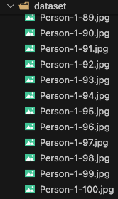
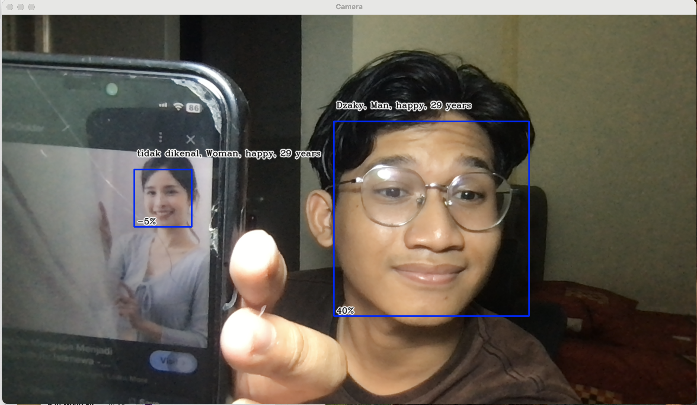
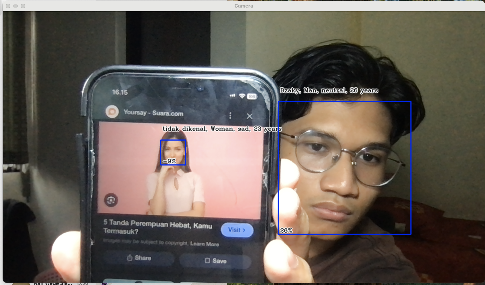
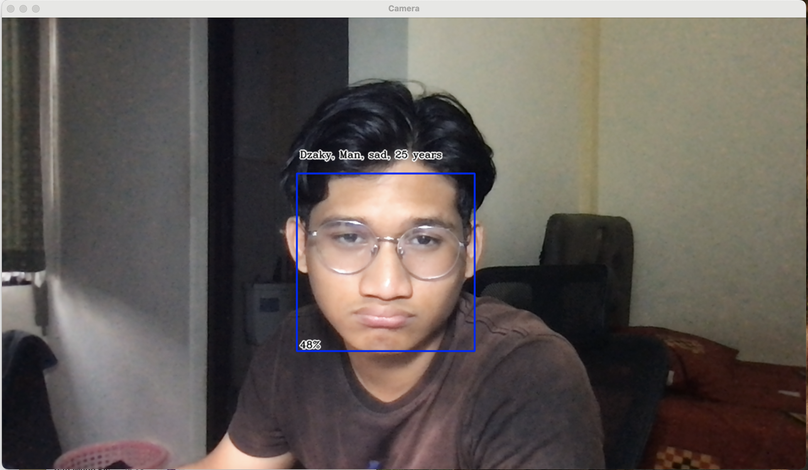
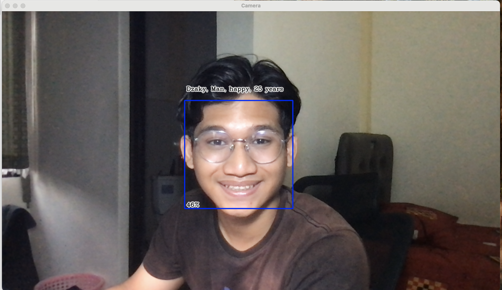

# Face Recognition Demo

## Group 1 - Week 9 Task - Emerging Technologies

- **Dzaky Purnomo Rifa'i** - 5026221085
- **Felicia Evelina Soetjipto** - 5026221072
- **Diva Ardelia Alyadrus** - 5026221029

---

## Project Overview

This project demonstrates a complete workflow for face recognition, including dataset creation, training, and real-time testing. The system captures facial images from a live camera feed, trains a recognition model, and performs analysis to detect various facial features such as gender, emotion, and age.

---

## Steps

### 1. Create Dataset (`face_create_dataset.py`)

The first step involves collecting a dataset of facial images directly from the camera for training the face recognition model.

- **Process:**
  - Load the face detection model using Haar cascades.
  - Open a video stream from the camera.
  - Create a directory for the dataset if it doesn't exist.
  - Capture images and convert them to grayscale.
  - Detect faces in each frame and store them in the dataset folder with a structured naming convention, including the person ID and image number.

This process continues until 100 images are collected or the user presses 'q' to stop the image capturing.

---

### 2. Train Dataset (`face_training.py`)

In this step, we prepare and train the face recognition model using the collected dataset.

- **Process:**
  - Check for the presence and completeness of the dataset.
  - Organize images by detecting faces and storing the corresponding face data and IDs.
  - Train the face recognition model using the Local Binary Patterns Histograms (LBPH) algorithm, which is effective in handling variations in lighting and facial expressions.
  - Save the trained model to a file named `face-model.yml` for future use in real-time face recognition or new image analysis.

---

### 3. Test Dataset (`face_recognition.py`)

The final step performs face recognition and analysis of facial features in real-time.

- **Process:**
  - Initialize the face recognizer by loading the trained model.
  - Use Haar cascades to detect faces in the live video feed.
  - Draw rectangles around detected faces and predict the face ID using the recognizer.
  - Analyze the detected faces with DeepFace to obtain information about gender, dominant emotion, and age.
  - Extract the gender with the highest probability from the analysis results.
  - Display the analysis results on the video frame, including ID, gender, emotion, and age.

The system continues to process frames until the user presses 'q', after which the camera stream is released and all OpenCV windows are closed.

---

## Conclusion

This face recognition demo showcases the ability to collect, train, and analyze facial data in real-time. By utilizing techniques like Haar cascades for detection and LBPH for recognition, along with DeepFace for feature analysis, this project serves as a comprehensive introduction to facial recognition technology.

---
